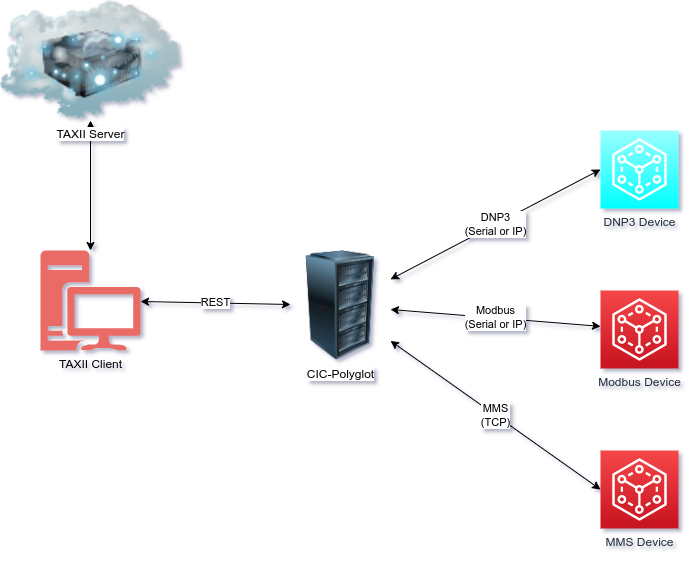

# CIC-PolyglOT Use-Case Architecture
The objective of CIC-PolyglOT is to have a system that receives STIX-based remediation information, parses them and executes 
the appropriate Fieldbus commands to the Fieldbus device. For example, after receiving threat intelligence information, a request in the 
form of a STIX object is sent to CIC-PolyglOT via TAXII to read a status of a Modbus device. CIC-PolyglOT parses the object and sends the
approriate read request to the Modbus device. Currently, CIC-PolyglOT supports Modbus (TCP and Serial), DNP3 (TCP and Serial) and MMS. Other
protocols will be continuously added. To see how CIC-PolyglOT can be communicated with, check out the code in the [Client_TAXII_2_1](Client_TAXII_2_1) folder. We recommend using Python 3 and above.



# Folder Structure
* Client_TAXII_2_1
    * This folder contains code for TAXII 2.1 client. It interacts with TAXII 2.1 Server and CIC-PolyglOT.
    * It pulls customized STIX OT Objects from the TAXII server and queries to the DXL server using the objects.
    * It contains OT-based customized STIX objects.
    * It currently creates the custom STIX OT objects, populates a TAXII server with it and then retrieves the objects and uses them to query CIC-PolyglOT
* CIC-PolyglOT
    * This folder contains code for the CIC-PolyglOT.
    * It receives custom STIX Objects
    * It also contains the STIXFieldBusMapper, TAXIITransceiver, DNP3Transceiver, ModbusTransceiver, MMSTransceiver and GOOSETransceiver (not tested)
* Server_TAXII_2_1
    * This folder contains code for implementing a TAXII 2.1 server.  
* Dockerized_Apps
    * This contains files to dockerize Client_TAXII_2_1 and CIC-PolyglOT

# Docker Installation
Our main work is the CIC-PolyglOT, other folders were included to because they contain code to connect to CIC-PolglOT. Those can be used as reference to create your own FieldBus clients and TAXII clients and servers. We used version 2.1 for TAXII and STIX
It is recommended that you run the Dockerized applications because they already handle the heavy lifting for the TAXII client and CIC-PolyglOT. Changes need to be made to the environment variables in the docker-compose file before building the docker containers.
For serial connections, please refer to the [Serial Port Configurations](# Serial Port Configurations) section. The serial connection configuration can be commented out in the docker-compose file if it is not desired.

# Normal Installation
If Docker containers are not preferred then some installations need to be made as specified in each of the individual folders where specified. For serial connections, please refer to the [Serial Port Configurations](# Serial Port Configurations) section.


# Serial Port Configurations
To run serial, you can use [tty0tty](https://github.com/lcgamboa/tty0tty)(for Linux) or [com0com](https://sourceforge.net/projects/com0com/)(for Windows) to create the serial-port pairs and specify them in your Modbus or DNP3 simulators and in the environment variables.
For Linux, you can use socat to create the serial connection.

The script serial_simulator.sh can be used to create a serial port pair for ttyS0<-->ttyS1 and ttyS2<-->ttyS3. If those pairs are in use you can choose another by modifying the script.
Next, change the ownership and permissions (by using chmod and chown) of the pts device that each ttyS was linked to. You can find the pts by running ls -l /dev/ttyS*. See an example below:

```
//creating pairing for modbus, CIC-Polyglot uses ttyS0 and modbus server uses ttyS1
$ socat pty,raw,echo=1,link=/dev/ttyS0 pty,raw,echo=1,link=/dev/ttyS1
//creating pairing for DNP3, CIC-Polyglot uses ttyS2 and modbus server uses ttyS3
$socat pty,raw,echo=1,link=/dev/ttyS2 pty,raw,echo=1,link=/dev/ttyS3

//open another terminal
//run ls -l /dev/ttyS* to find the pts that they are linked to (instead of * you can specify the device number)
$ ls -l /dev/ttyS*

//change ownership
$sudo chown <username> /dev/pts/*

//change permissions

$sudo chmod +r /dev/pts/*
$sudo chmod +w /dev/pts/*

//add your username to dialout group
$sudo usermod -a -G dialout <username>

```
# IEC61850 Setup
It is required to build the python version of libiec61850, copy the iec61850.py and _iec61850.so files to iec61850 folder located within the CIC-Polyglot Folder.

# Support
For support and other details, please contact [Kwasi Boakye-Boateng](mailto:kwasi.boakye-boateng@unb.ca).

# Contributors
[Ida Sri Rejeki Siahaan](mailto:ida.siahaan@unb.ca)

[Mahdi Abrishami](mailto:mahdi.abrishami@unb.ca)

[Kwasi Boakye-Boateng](mailto:kwasi.boakye-boateng@unb.ca)
